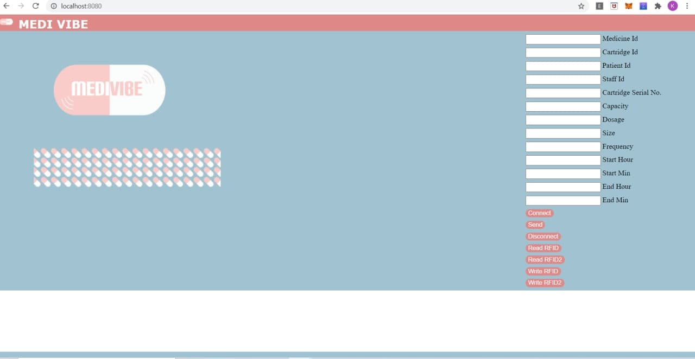
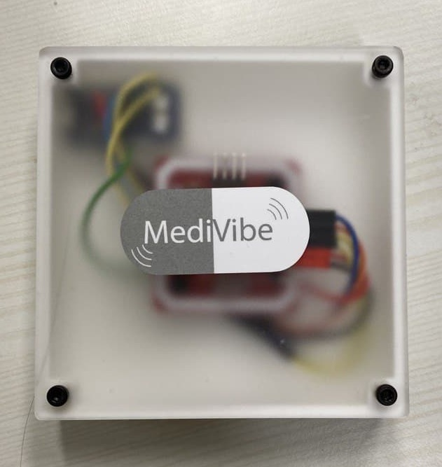
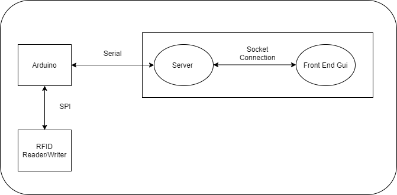

# MediVibe Web User Interface

## Description
The Medivibe Web UI is a web based user interface for the [MediVibe](https://github.com/lkw303/MediVibe) medicine dispenser that allows for the ease of reading and writing of information to and from the RFID of the medicine cartridge.
<br><br/>
Web User Interface            |  RFID Reader/Writer
:-------------------------: |:-------------------------:
 | 
    
<br/>
The pharmacist is able to key in the dispensing information of the medication using the web user interface such as the medication identification number, the frequency the medication should be taken and the dosage (i.e number of pills taken each schduled time). This information will then be flashed into the RFID chip on the medical cartridge. On loading the cartridge onto the dispenser the dispenser then dispenses the pills accordingly.
<br><br/>

The UI also allows for the pharmacist to the data from the RFID thus allowing them to double check the data they have just flashed into the RFID as well as check the previous data input into the RFID.

<br><br/>


## How it works
The Arduino communicates with the RFID reader/writer via SPI. The data that is to be flashed to or read from the RFID reader/writer is sent/received to from the Server using a serial connection. The Server interfaces with the Front end GUI via websockets using the Socket.io library.
<br><br/>



<br><br/>

## Installation
```
git clone https://github.com/lkw303/MediVibe_UI.git
cd MediVibe_UI
npm install
```


